#+TITLE: 1 Memory Management
#+AUTHOR: Ben Heinze
#+DATE: 2026-08-31
#+TAGS: memory-management, operating-systems
#+STARTUP: noindent

#+MACRO: hl @@html:$2@@@@latex:\hl{$1}{$2}@@

# This is used to shrink the pdf page margins
#+LATEX_HEADER: \usepackage[left=0.75in,right=0.75in,top=1in,bottom=1in]{geometry}

# This is used to shrink the spacing between bullet points
#+LATEX_HEADER: \usepackage{enumitem}
#+LATEX_HEADER: \setlist[itemize]{itemsep=2pt, topsep=4pt}

Slides: [[file:Memory Management.pdf][Memory Management (PDF)]] · [[file:Memory Hierarchy.pdf][Memory Hierarchy (PDF)]] · [[file:Virtual Memory.pdf][Virtual Memory (PDF)]]: Adiesha Liyana Ralalage

* Uniprogramming
Early memory management systems
- early computer systems supported one user and one program at a time (aka /uniprogramming/)
- To execute a program, the entire program had to be loaded continuously into main memory
- What are the implications?
  - Lots of wasted resources when waiting
  - Memory constraints are inefficient

The deck breaks that inefficiency down:
- The program size was /limited by the amount of available memory/
- If a program did not use all the allocated memory, the unused memory was /wasted/
- When the program was /waiting for an I/O operation/, the CPU remained /idle/
- As a result, /CPU and memory resources were often underutilized/

* Multiprogramming

In a /multiprogramming/ system, the user portion of memory must be divided to accommodate multiple processes.
- OS dynamically manages this division of memory (aka memory management)
- /Memory management/ (MM) determines how memory is allocated and used by different processes.

Some of the memory-management techniques we will study are relatively old and may not be used directly in modern systems. They still matter because they provide the fundamental concepts behind modern memory-management systems, and they help explain why modern operating systems use more sophisticated mechanisms. The underlying ideas are still valuable, learning them builds techniques and ways of thinking that apply to other problems.

* Memory Management Requirements

** Relocation

/Relocation: Ability to load program to any available part of the main memory. Access memory locations regardless of where its loaded./
- in multiprogramming system, available memory is shared among multiple processes
- Typically, programmers do not know in where the program will be in the main memory in advance
- Active processes need to be able to be swapped in/out of main memory in order to maximize processor utilization

This memory management requirement raises a lot of technical problems
- How can the programmer access memory without having to worry about relocation?

He shows figure 7.1: addressing requirements for a process, the process image laid out at increasing address values as process control information, then the program (with its entry point and a branch instruction), then data (with a reference to data), then the stack with its current top.

** Protection

/Protection: Ensure memory space allocated to the process you're running cant be accessed by unauthorized programs/

- Each process needs to be protected against unwanted access y other programs
- Relocation requirement makes harder to enforce protection since location of a program in main memory is unpredictable
- memory references generated by process must be checked at run time
- Processes need to acquire permission to reference memory locations for reading and writing purposes
- Schemes that support relocation must also support protection

** Sharing

- Sharing: allowing multiple programs/users to access common memory areas efficiently

he skipped over the deep dive for this one

From the slides:
- Simultaneously, programs should be able to access some shared memory
  - If there is a common library used by several programs, we should not load the library more than once, to conserve main memory
- Memory management must allow controlled access to shared areas of memory without compromising protection
- Mechanisms used to support relocation support sharing capabilities

** Logical Organization
/Logical organization: structuring memory to support program modularity (e.g., separating code, data, and stack) for easier development and execution./

he skipped over the deep dive for this one

From the slides:
- Main memory and secondary memory are usually organized as a linear or one-dimensional address space
- Programs are typically not like this, programs have modules
  - Some parts of programs are unmodifiable
  - Some parts can be modified
- The OS needs to deal effectively with the linearity of hardware and the modularity of programs

** Physical Organization
/Physical organization: Managing the actual hardware memory (RAM, registers) to allocate and deallocate contiguous or non-contiguous blocks efficiently, addressing fragmentation challenges in early systems and optimizing resource use in modern ones/

- In earlier systems, the OS didn't have ability to move main program to from main memory to secondary memory. they used /overlaying/ where different program sections were loaded into the same memory... *(check notes later)*

Filling that in from the slides:
- Computer memory is organized in at least two levels: /main memory/ (fast, volatile, limited in size) and /secondary memory/ (slower, cheaper, much larger, non-volatile)
- Speed and cost trade off directly against each other: faster access means higher cost per byte, so fast memory is kept small and slow memory is made large
- The OS can exploit this by keeping programs in secondary memory when they aren't executing or are blocked on long I/O waits, freeing main memory for active work
- When the main memory available to a program is too small to hold it all at once, its code and data must be moved in and out during execution
  - In early systems this was the programmer's job, using a technique called /overlaying/, where different program sections are loaded into the same memory region as they're needed
- Overlaying is impractical, and /relocation/ makes it worse: the programmer can't know ahead of time where in main memory the program will be placed, or how much space will be available (especially with multiprogramming)
- Therefore, moving information between the two memory levels must be the OS's responsibility, not the programmer's

* Fixed Partitioning

Fixed Partitioning Idea: partition memory into set of fixed partitions

First, assume the OS occupies portion of main memory, and the rest of the main memory is available for use by multiple processes
- two ways to partition memory:
  1. Equal sized partitions
  2. Variable sized partitions
- Any process whose size $\leq$ partition size can be loaded into the available partition.
- if partitions are full, and process is ready or in running state, the OS can swap a process out of any partition and loaded another process

He shows figure 7.2: example of fixed partitioning of a 64-Mbyte memory. One block is equal sized, and the other is variable sized. Equal-size is eight 8M partitions below the OS's own 8M; unequal-size is 2M, 4M, 6M, 8M, 8M, 12M, 16M.

** Equal sized partitioning
- program could be larger than the partition: programmer must use overlays to handle this problem
- Regardless of the size of the program, the entire partition is used by a particular process
- /internal fragmentation/: if you have a lot of small programs running, space is not utilized properly
  - Internal fragmentation occurs when a process is smaller than the partition it's allocated to; the leftover space inside the partition is wasted and can't be used by any other process

** Unequal sized partitioning
- Larger programs can be handled properly
- slightly better at handling smaller programs since we do have smaller partitions
- Can still have internal fragmentation

** Placement Algorithms

For equal sized partitions, as long as there is a free partition, you can load the program into it. If there are no available partitions swap a process already int the main memory to the secondary storage and load the new program to that partition

For unequal sized partitioning, assign the new process to the smallest available partition
- Use a scheduling queue for each partition, where each corresponding process will wait in the queue for the partition
- efficient in terms of low fragmentation, but (check notes later)

Finishing that thought from the slides: per-partition queues are efficient in terms of low fragmentation, because we always put the process into the best possible partition that minimizes internal fragmentation, but this is *not optimum from the point of view of the system*. Disadvantages:
- Wait time might be higher
- May need to swap processes to free up space

He shows an example where there are four partitions of varying sizes. The goal is to minimize internal fragmentation, but it doesn't efficiently utilize main memory, since programs are only being loaded based on size and not taking into account of available partitions.

The worked example: main memory is divided into four unequal partitions of 100 KB, 200 KB, 300 KB and 500 KB. Processes arrive needing 90 KB, 180 KB, 250 KB and 450 KB, and then P5 needs 150 KB.

*** One queue for everything
- We can also have one queue for all the processes
  - Then we allocate each process to the best available smallest partition in main memory
  - This improves the overall wait time
  - Obviously, if all the partitions are being used, we need to swap processes to free up space

** Disadvantages
- If your program is larger than all of the partitions, then {{{hl(red,overlays)}}} must be used
- {{{hl(red,internal fragmentation)}}}
- number of partitions specified at system generation time limits the number of active (not suspended) processes in the system

* Dynamic Partitioning

To overcome some problems in fixed partitioning, dynamic partitioning was introduced.

Partitions are of variable length and number.
- When a process is brought to memory, it is allocated exactly as much memory it requires

OS needs to keep track of boundaries of the partitions

/What happens when we use this strategy?/
- *External Fragmentation*: You will  see a lot of small holes in the main memory which cannot be occupied by processes.
  - To remove this, we use /compaction/, which squishes the processes in the main memory to remove the gaps in memory, giving you one continuous free space rather than small holes between the processes.

** Dynamic Placement Algorithms

Since compaction is time consuming and resource hungry the OS needs to be clever when choosing the best position for a process to reside in dynamic partitioning

For example, if there is more than one free block, which one should the OS use for placing the new process?

| Algorithm | Description | Worst case |
| Best-fit  | Chooses the block that is closest in size to the request        | $O(n)$. |
| First-fit | Begings to scan memory from the beginning and pics the first free hole the process will fit in | Worst one since it will quickly leave very small holes in memory, which requires compaction sooner than later|
| Next-fit  | begins to scan memory from the location of the last placement and chooses the next available block that is large enough. Once it reaches the end, it will go back to the beginning of the main memory (like best-fit but resumes from the last allocation) | Best option out of the three|

* Buddy system
- Combination of fixed and dynamic partitioning schemes.
- {{{hl(orange,Read about this scheme in the book, will be on quiz)}}}

From the book: memory blocks are always of size $2^{K}$, with $L \le K \le U$
($2^{L}$ the smallest block allocated, $2^{U}$ the whole space).
- A request of size $s$ takes a block of size $2^{K}$ where $2^{K-1} < s \le 2^{K}$
- If no such block is free, /split/ the smallest available larger block in half,
  repeatedly, until a $2^{K}$ block appears. The two halves of a split are /buddies/
- On release, if the released block's buddy is also free, /merge/ the pair back into
  one block of twice the size, then keep merging upward while the new buddy is free

Example, 1 MB of memory, request 100 KB: split 1 MB $\to$ two 512 KB $\to$ two
256 KB $\to$ two 128 KB, and allocate one 128 KB block (28 KB internal
fragmentation).

- Compromise: less external fragmentation than dynamic partitioning (free blocks
  coalesce predictably) and less internal fragmentation than fixed partitioning
  (block sizes adapt), but rounding every request up to a power of two still wastes
  space.

* Memory Deallocation

When the partitions are not used anymore, they should be released.

** Fixed partitions
Reset the free/busy status of the partition

| Partition # | Starting | End | Action (binary if process is used or not) |
| 0           | -        | -   | 0                                         |
| 1           | -        | -   | 1                                         |
| 2           | -        | -   | 0                                         |
| 3           | -        | -   | 1                                         |
| 4           | -        | -   | 1                                         |

** Dynamic Partition

Need to combine the free areas

/Question: does the schemes we looked at provide a way to overcome problems arising from relocation requirement?/

* Relocation - fixed vs Dynamic Partitioning
- A process will not always occupy the same place in memory over its lifetime
  - It can be swapped out to disk, then swapped back into a different partition or hole than before
  - Under dynamic partitioning, compaction can also shift a resident process to merge scattered free space
- Dynamic partitioning $\to$ relocation is *always* required
  - Swap-in lands the process in a different hole, and compaction moves processes around
- Fixed Partitioning $\to$ relocation is required *only if* a process can be reassigned to a different partition
  - Single queue for unequal partitions: the process may be reloaded elsewhere $\to$ relocation needed
  - Process always returns to its own partition, so its load address never changes $\to$ no relocation
- Consequence: The addresses a process references are *not fixed*
  - They change each time the process is swapped in or shifted
  - So addresses must be resolved at run time, via base (and bounds) registers

* Types of Addresses

| Type                 | Description                                                                                                          |
| Physical or Absolute | Actual location in main memory                                                                                       |
| Logical              | Reference to a memory location independent of the current assignment of data to memory                               |
| Relative             | A particular example of logical address, in which the address is expressed as a location relative to some kown point |

* Relative Addressing

- Memory reference in a loaded process are relative to the origin of the program
- Hardware mechanism to translate relative addresses to physical addresses
  - *Bounds register*: ending location of the program
  - *Base register*: starting address of the running program

He shows a diagram of hardware support for relocation

* Paging

Both unequal fixed-size and variable-size partitioning schemes use memory inefficiently
- /Fixed/: internal fragmentation (wasted space inside a partition)
- /Variable/: external fragmentation (holes between allocations)

/Paging/ eliminates external fragmentation and limits internal fragmentation.

- Partition memory into equal fixed-size chunks that are relatively small
- The process is also divided into small fixed-size chunks of the same size

| Term   | Meaning                      |
| Pages  | Chunks of a process          |
| Frames | Available chunks of memory   |

* Memory Management terms

| Term | Def |
| Frame | Fixed-length block of memory |
| Page  | fixed-length block of data that resides in secondary memory (such as a disk). A page of data may temporarily be copied into a frame of main memory. Paging doesn't require consecutive frames, so it's able to fill in the gaps (Hence elimiating external fragmentation)|
| Segment       | A variable-length block of data that resides in secondary memory. An entire segment may temporarily be copied into an available region of memory (segmentaiton) or the segment may be divided into pages which can be individually copied into main memory (combined segmentation and paging |

* Page Table

Maintained by OS, one for each process
- Maps each page in the process to the frames that it holds
  - (/page number $\to$ frame number/)
- Accessed by the processor via hardware mechanism that points to the current process's page table
- Used by processor to translate logical address into a physical address at runtime
- Used by the processor to produce the physical address
- page (and frame) size is always a power of 2
  - easier to convert logical $\to$ physical address
  - $\left[ \log_{2} \text{pages-size} \right] =$ the number of memory locations you have in a page, this is the maximum number of pages you can have in a process. If you have 16-bit address with a page size of 1kb, you'd have $\left[ \log_{2} 1024 = 10 \right]$ pages.

* Segmentation

A program can be subdivided into segments
- vary in length
- there's a max length

Segment table to represent the starting location and size of each segment loaded into the main memory

Addressing consists of two parts:
1. Segment number
2. Offset

Similar to dynamic partitioning. Eliminates internal fragmentation

- Visible to the programmer, unlike paging which is invisible
- provided as a convenience for organizing programs and data logically
- programmer or compiler assigns code and data to different segments (code, stack, heap, globals, etc)
- For modular programming, code/data may be split further into multiple segments
- Main drawback: Programmer must stay aware of the /maximum segments size/

** Address Translation

Another consequence of unequal size segments is that there is no simple relationship between logical addresses and physical addresses:

1. Extract segment number as the leftmost /n/ bits of the logical address
2. Use number to access process's segment table to find starting physical address of the segment
3. compare offset, express rightmost /m/ bits. If offset $\geq$ segment length, it is invalid
4. The desired physical address is the sum of the starting physical address of the segment plus the offset

* Memory Hierarchy

These are from the (2026-09-09) lecture: the /Memory Hierarchy/ deck, not the
memory management deck above.

** Design constraints

What are the design constraints on a computer's memory
- How much?
  - If the capacity is there, applications will likely be developed to use it
- How fast?
  - Memory must be able to keep up with the processor
- How expensive?
  - Cost of memory must be reasonable in relationship to the other components

There is a trade-off between these things:

/Faster access time = greater cost per bit/ $\to$ /Greater capacity = smaller cost per bit/ $\to$ /Greater capacity = slower access speed/

What is the solution?
- A memory hierarchy

** The hierarchy

Going down the hierarchy
- A. Decreasing cost per bit
- B. Increasing capacity
- C. Increasing access time
- D. Decreasing frequency of access to the memory by the processor

#+ATTR_HTML: :alt Figure 1.14 The Memory Hierarchy
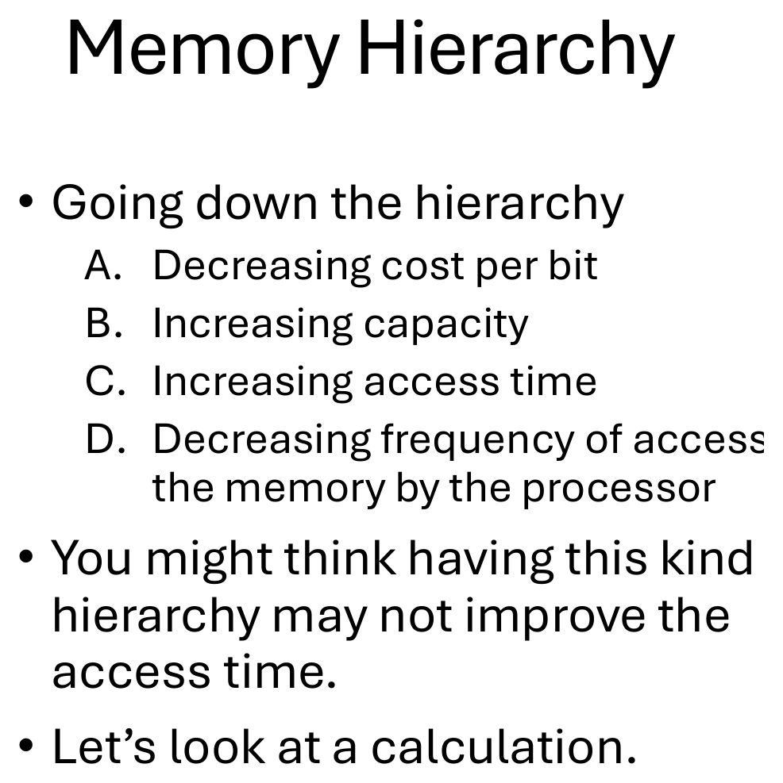

- You might think having this kind of hierarchy may not improve the access time.
- Let's look at a calculation.

** Hit Ratio (H) and Average Access Time (A)

Hypothetical memory system
- Two levels
- Level 01: 1000 Bytes: $0.1 \mu s$ access time.
- Level 02: 100000 Bytes: $1 \mu s$ access time.
- $H = fraction\ of\ memory\ accesses\ that\ are\ found\ in\ fastest\ memory$

What is average access time as a function of the above parameters?

\[
A = H \cdot 0.1 \mu s + (1 - H) \cdot (1 \mu s + 0.1 \mu s)
\]

If $H = 0.95$, then

\[
A = 0.15 \mu s = 0.95 \cdot 0.1 \mu s + 0.05 \cdot (1 \mu s + 0.1 \mu s)
\]

#+ATTR_HTML: :alt Figure 1.15 Performance of a Simple Two-Level Memory
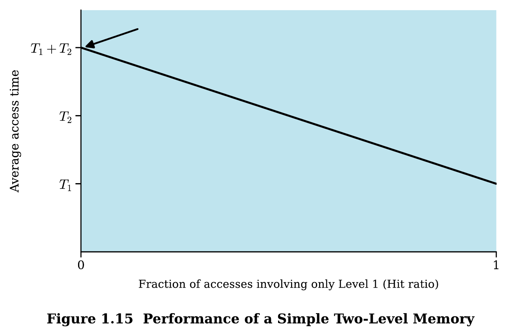

- As long as the conditions A–D that we looked earlier holds, the average access time is closer to the fastest memory access time.
- Condition D is generally valid.

** Principle of Locality

- Memory reference by the processor tend to cluster.
- Data is organized so that the percentage of accesses to each successively lower level is substantially less than that of the levels above.
- Can be applied across more than two levels of memory
- Program execution is mostly sequential.
- For short periods of time, references to instructions tends to be localized.
- Many programs involves processing data structures such as arrays or sequential records which tends to cluster together.

** Secondary memory/Auxiliary memory

- Nonvolatile.
- External.
- Used to store program and data.
- Less expensive.

** Cache Memory

- Largely invisible to the OS
- Interacts with other memory management hardware
- Processor must access memory at least once per instruction cycle
- Processor execution is limited by memory cycle time
- Exploit the principle of locality with a small, fast memory

#+ATTR_HTML: :alt Figure 1.16 Cache and Main Memory
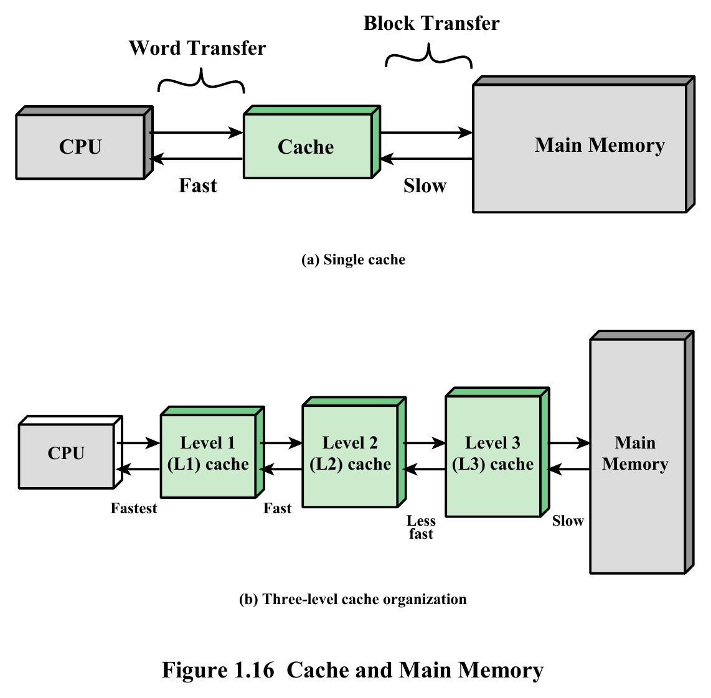

#+ATTR_HTML: :alt Figure 1.17 Cache/Main-Memory Structure
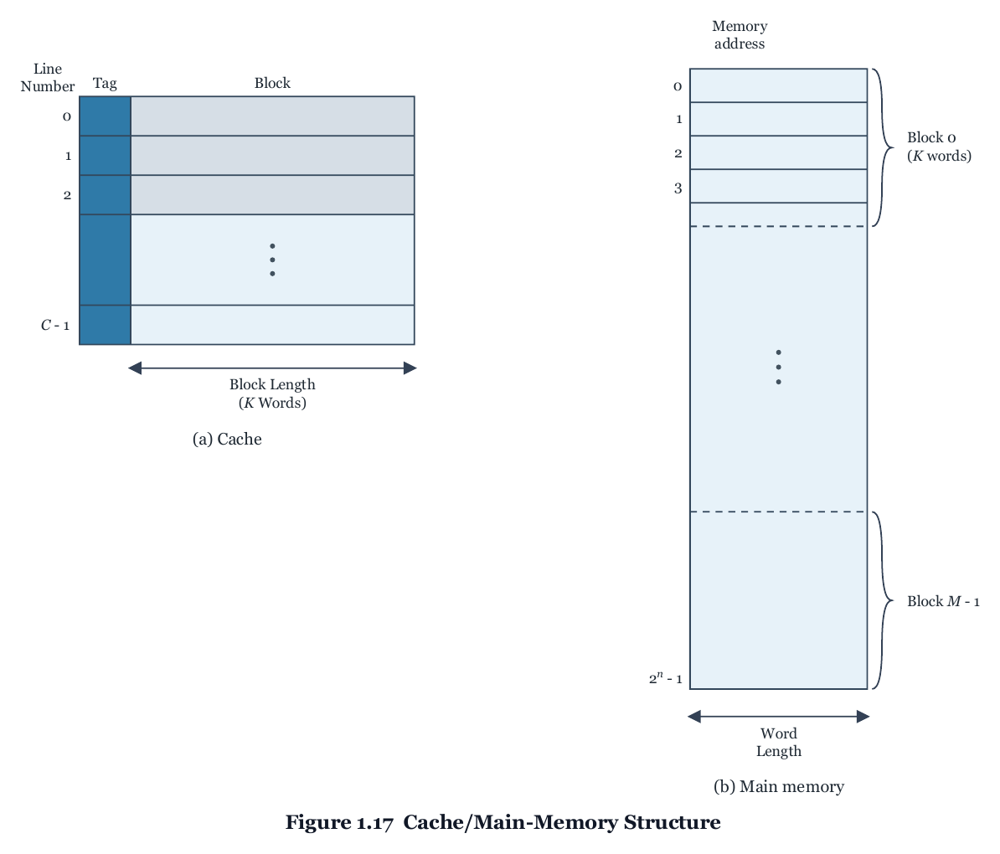

{{{hl(blue,Animation slide: =cache-memory-structure.html=. The animation itself is not in the PDF.)}}}

#+ATTR_HTML: :alt Figure 1.18 Cache Read Operation
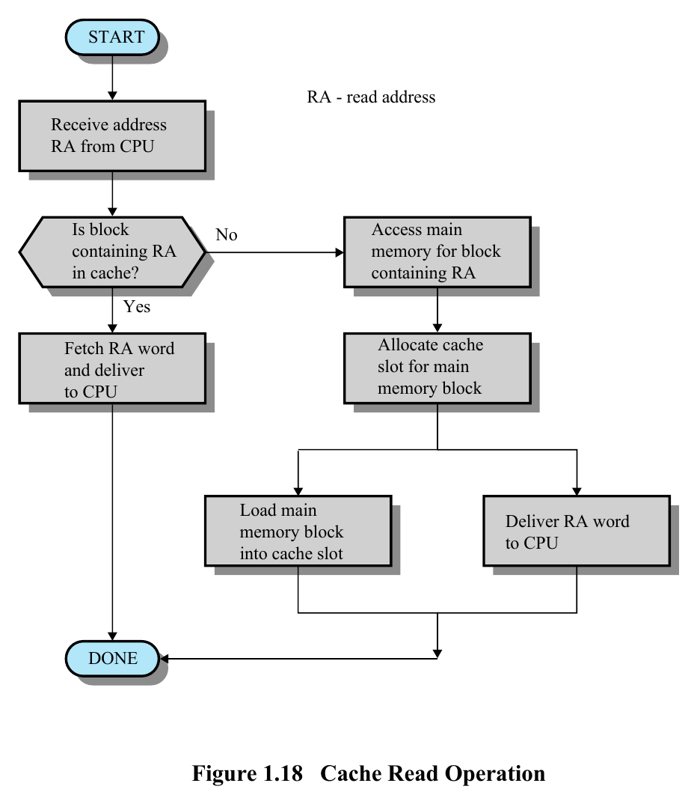

{{{hl(blue,Animation slide: =cache-read-operation.html=. The animation itself is not in the PDF.)}}}

** Cache Design

Main categories are:
- Cache size
- Block size
- Mapping function
- Replacement algorithm
- Write policy
- Number of cache levels

*** Cache size and Block size

| Term       | Meaning                                                  |
| Cache Size | Small caches have significant impact on performance      |
| Block Size | The unit of data exchanged between cache and main memory |

- Increasing block size initially improves the hit ratio because each transfer brings in more nearby data.
- This exploits spatial locality: nearby data are likely to be accessed soon.
- If the block becomes too large, the hit ratio decreases because much of the newly fetched data may not be used.
- Large blocks also evict useful data from the limited cache, reducing the chance of future cache hits.
- Therefore, there is a "sweet spot" for block size that provides a good balance between exploiting locality and avoiding unnecessary data transfers and evictions.

*** Mapping function

Determines which cache location the block will occupy.

Two constraints affect design:
- When one block is read in, another may have to be replaced
- The more flexible the mapping function, the more complex is the circuitry required to search the cache

1. *Direct Mapping*
   - Each memory block has exactly one possible cache location.
   - Ex: $Cache\ location = Memory\ block\ number \bmod 10$
   - $37 \bmod 10 = 7$
2. *Fully Associative Mapping*
   - A memory block can go anywhere in the cache.
   - Ex: Block 37 can fit into any slot
   - Advantage: Very flexible; fewer conflicts.
   - Disadvantage: The cache has to search/compare against many entries to determine whether the requested block is present, making the hardware more complex.
3. *Set Associative Mapping*
   - This is a compromise between the two.
   - Divide the cache into sets. A memory block is assigned to one particular set, but it can go into any slot within that set.
   - For example, suppose we have 10 cache slots organized into 5 sets, with 2 slots per set:
     - Block #37 might be assigned to Set 2.

*** Replacement algorithm

- Least Recently Used (LRU) Algorithm
  - Effective strategy is to replace a block that has been in the cache the longest with no references to it
  - Hardware mechanisms are needed to identify the least recently used block
    - Chooses which block to replace when a new block is to be loaded into the cache

*** Write Policy

Dictates when the memory write operation takes place

- Can occur every time the block is updated
- Can occur when the block is replaced
  - Minimizes write operations
  - Leaves main memory in an obsolete state

Could there a scenario where updating main memory after each update in the cache is beneficial?
- Multiple processors may share main memory and write-through ensures all processors see consistent data without needing complex coherence protocols.

** Analysis of Two-level memory

- Level 1 ($M_{1}$): faster, expensive, smaller
  - $T_{1}$: access time for $M_{1}$
  - $C_{1}$: average cost per bit for $M_{1}$
  - $S_{1}$: size of $M_{1}$
- Level 2 ($M_{2}$): slower, cheaper, larger
  - $T_{2}$: access time for $M_{2}$
  - $C_{2}$: average cost per bit for $M_{2}$
  - $S_{2}$: size of $M_{2}$

\[
T_{s} = H \times T_{1} + (1 - H) \times (T_{1} + T_{2}) = T_{1} + (1 - H) \times T_{2}
\]

*** Average cost per bit

$C_{s} = Average\ cost\ per\ bit\ for\ the\ combined\ two\ level\ memory$

\[
C_{s} = \frac{C_{1}S_{1} + C_{2}S_{2}}{S_{1} + S_{2}}
\]

- We would like $C_{s} \approx C_{2}$
  - Given that $C_{1} \ggg C_{2}$, this requires $S_{1} \lll S_{2}$

#+ATTR_HTML: :alt Figure 1.22 Relationship of Average Memory Cost to Relative Memory Size for a Two-Level Memory
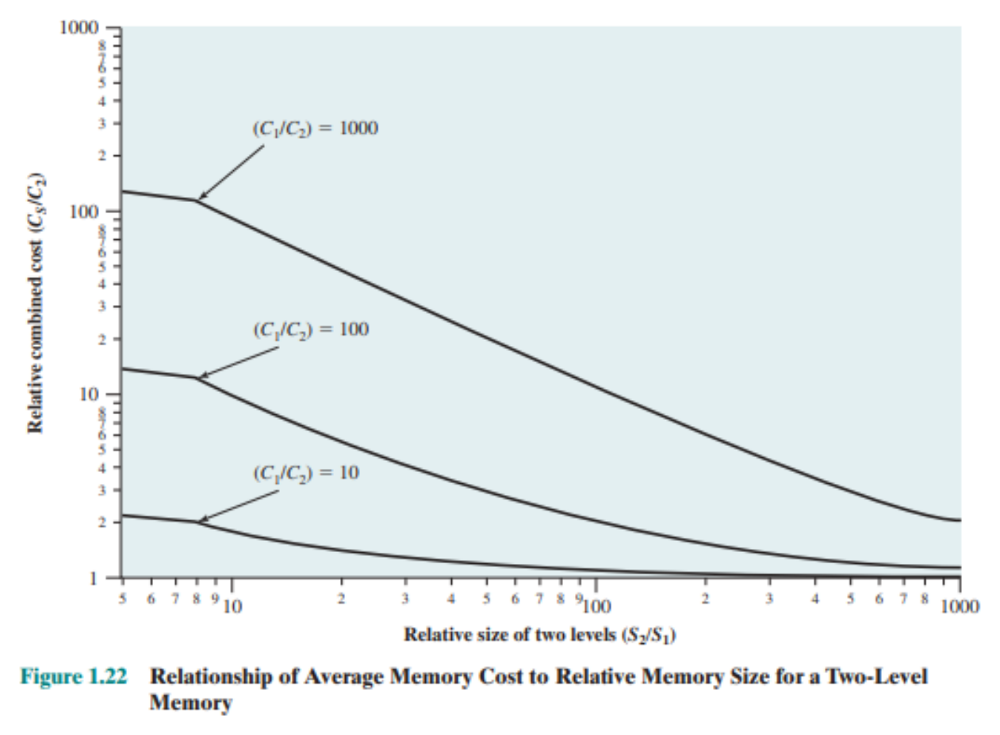

*** Access time ($T_{s}$)

- For a two-level memory to provide a significant performance improvement, we need $T_{s}$ approximately equal to $T_{1}$.

\[
\frac{T_{1}}{T_{s}} = \frac{1}{1 + (1 - H) \cdot \frac{T_{2}}{T_{1}}}
\]

- $\frac{T_{1}}{T_{s}}$ is called *Access efficiency*
- Let $r = \frac{T_{2}}{T_{1}}$ (ratio of access time of memory level 2 to level 1)

#+ATTR_HTML: :alt Figure 1.23 Access Efficiency as a Function of Hit Ratio (r = T2/T1)
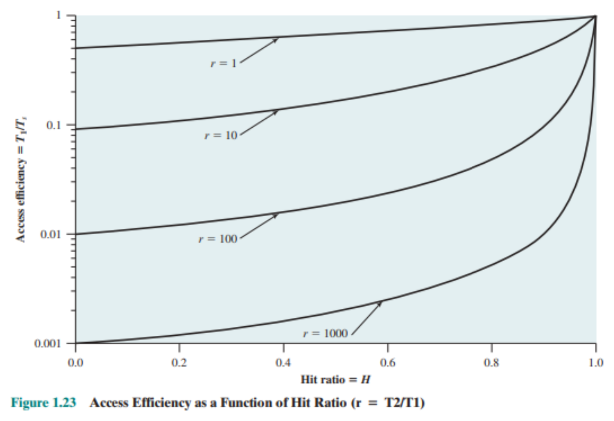

* Virtual Memory

These are from the (2026-09-11) lecture: the /Virtual Memory/ deck.

** Terminology

| Term                  | Definition                                                                                                                                                                                                                                              |
| Virtual memory        | Uses secondary storage (e.g., disk) as if it were main memory (RAM). Programs use their own addresses, which the system automatically translates to real physical locations. Its size is capped by the system's addressing scheme and available secondary storage, not by the actual amount of RAM. |
| Virtual address       | An address in virtual memory, used as if it pointed to main memory.                                                                                                                                                                                     |
| Virtual address space | The virtual memory assigned to a single process.                                                                                                                                                                                                        |
| Address space         | The full range of addresses a process can use.                                                                                                                                                                                                          |
| Real address          | The address of an actual location in main memory (RAM).                                                                                                                                                                                                 |

** Hardware and Control structures

- There are two fundamental breakthroughs that emerged through paging and segmentation.
  1. All memory references are logical addresses that are dynamically translated into physical addresses at run time.
  2. A process may be broken up into a number of pieces that don't need to be contiguously located in main memory during execution.
- If these two characteristics are present:
  - It is not necessary that all the pages or segments to be in the main memory during the execution of the program.

** Execution of a process

- Operating system brings into main memory a few pieces of the program
  - /Resident set/
    - Portion of process that is in main memory
- An interrupt is generated when an address is needed that is not in main memory. (when paging is used, this is called /page fault/).
- Operating system places the process in a blocking state.

- Piece of process that contains the logical address is brought into main memory
  - Operating system issues a disk I/O Read request
  - Another process is dispatched to run while the disk I/O takes place
  - An interrupt is issued when disk I/O is complete, which causes the operating system to place the affected process in the Ready state.

** What are the implications of this strategy?

- More processes may be maintained in main memory.
  - Only parts of processes are loaded into the memory, therefore more room for new processes.
  - More ready state processes can be stored in the main memory.
- Processes that are larger than the main memory can be run.
  - Previously, programmer had to write overlays to load only part of the program to the main memory.
  - But now, with virtual memory based on paging or segmentation, this task is left to the OS and the hardware.

** Real vs Virtual Memory

| Real memory    | Main memory, the actual RAM                                                                                             |
| Virtual memory | Memory perceived by the process. Allows for effective multiprogramming and relieves the user of tight constraints of main memory |

#+ATTR_HTML: :alt Paging vs Segmentation: how memory is divided and addressed, and where virtual memory fits (slide image)
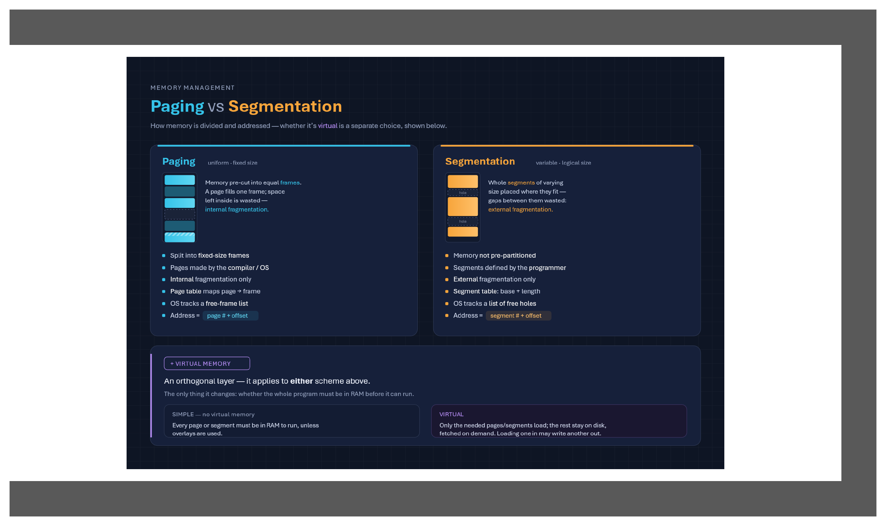

** When Memory Is Almost Full

Consider the following scenario:
1. Main memory is almost full.
2. A process needs a page that is not currently in main memory.
3. The OS must:
   - Swap out a page from main memory to secondary storage.
   - Bring in the requested page.
4. Suppose the page that was just swapped out is needed almost immediately.
5. The OS must:
   - Bring that page back into main memory.
   - Swap out another page to make room.
6. If this happens repeatedly, the OS spends most of its time swapping pages in and out rather than executing processes.

/Too much time managing memory $\to$ too little time executing processes/

{{{hl(blue,Animation slide: =thrashing.html=. The animation itself is not in the PDF.)}}}

** Thrashing

A state in which the system spends most of its time swapping process pieces rather than executing instructions.

To avoid this, the operating system tries to guess, based on recent history, which pieces are least likely to be used in the near future.

*** How Can We Avoid Thrashing?

- Use the principle of locality.
  - A program's memory references tend to cluster in a relatively small number of pages during a given period of time.
  - Therefore, during a short period, a process typically needs only a small subset of its pages.
  - The OS can use this behavior to make better decisions about which pages to keep in memory and which pages to evict.
  - If the pages that a process is actively using remain in memory, the number of page faults and page swaps can be reduced.
  - This helps prevent the system from spending most of its time paging instead of executing processes.

** What do we need for virtual memory scheme to work?

For virtual memory scheme to be practical, we need:
1. Hardware support for paging or segmentation or both.
2. Operating system must include software for managing the movement of pages and/or segments between secondary memory and main memory

** Control structures necessary for virtual memory

- Now, we will look at necessary control structures that are created and maintained by the OS but are used by the memory management hardware.
- Usually, when we talk about virtual memory, they are associated with systems that use paging.
  - However, you can use segmentation or combination of paging with segmentation for virtual memory.
- Each process has its own page table; This is the control structure.
  - Each page table entry (PTE) contains the frame number of the corresponding page in main memory. (we already talked about this when we looked at simple paging)
  - The page table is needed for virtual memory with little bit more information on it.
  - We looked at the page table in the last lecture, let's try to analyze the structure of the page table bit more.

#+ATTR_HTML: :alt Figure 8.1 Typical Memory Management Formats
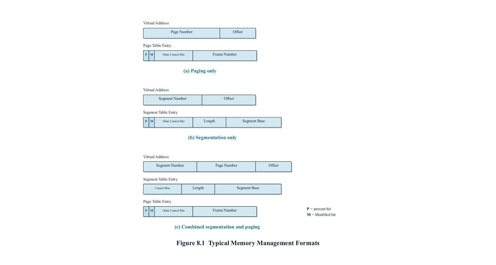

#+ATTR_HTML: :alt Figure 8.2 Address Translation in a Paging System
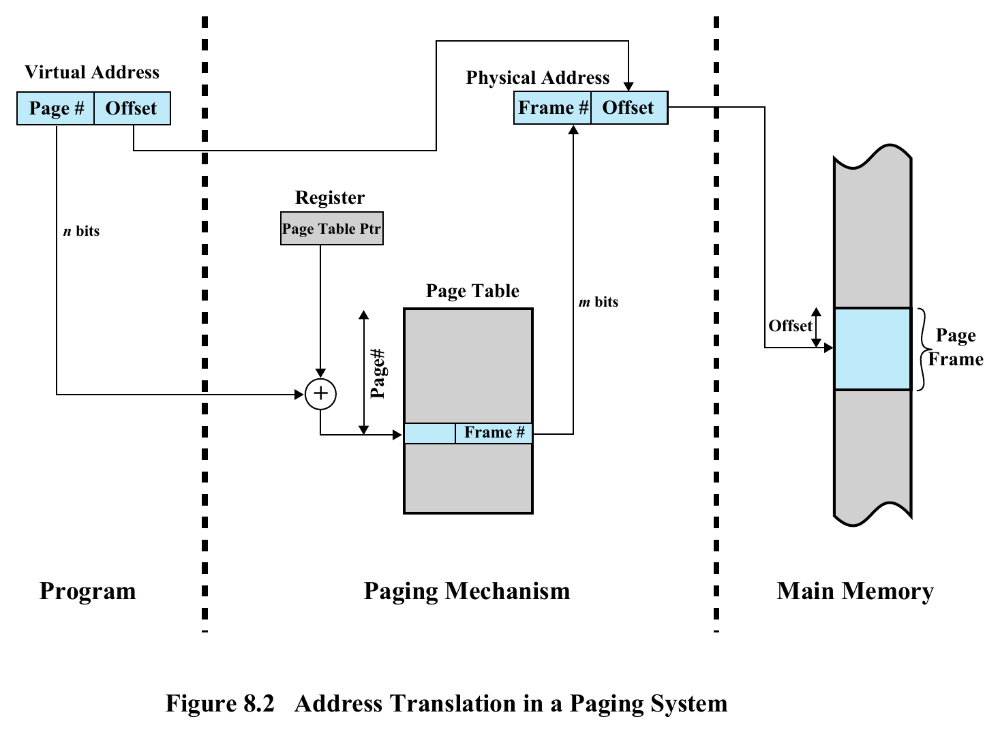

*** Question

Suppose Process A wants to change the page table entry for one of its virtual pages so that the page maps to a different physical frame. Can Process A simply modify the page table entry itself? Explain why or why not.

- No. Process A cannot directly modify its page table entry. The page table is managed by the operating system and is protected from user processes. If a process needs to change its memory mapping, it must request the operating system to do so through a system call. The OS then validates the request and, if permitted, modifies the page table.

{{{hl(blue,Animation slide: =paging-address-translation.html=. The animation itself is not in the PDF.)}}}

** How large can a page table be?

{{{hl(red,TEST)}}}

Let's work through an example.

Assume:
- Address size = 32 bits
- Byte-level addressing (1 byte per addressable unit)
- Page size = 4 KB = $2^{12}$ bytes
- Each page-table entry (PTE) = 4 bytes

Step 1: What is the maximum virtual address space?
- A 32-bit address can represent $2^{32}$ different addresses.
- Since we have byte-level addressing:
  - $\mathbf{2^{32}\ bytes = 4GB}$
- Therefore, the maximum virtual address space is 4 GB.

Step 2: How many pages can a process have?
- Each page contains $\mathbf{2^{12}\ bytes}$
- $\mathbf{\frac{2^{32}\ bytes}{2^{12}\ bytes/page} = 2^{20}\ pages}$
- A process can have at most $\mathbf{2^{20}\ pages}$.

Step 3: How large can a page table be?
- There is one page-table entry for each page.
- Each entry is 4 bytes.
  - $2^{20}\ entries \times 4\ bytes\ per\ entry = 2^{22}\ bytes = 4\ MB$
- Therefore, the maximum page-table size for one process is 4MB

Now consider a system with many processes:
- If 100 processes are running, and each has a 4 MB page table:
  - $100\ MB \times 4MB = 400\ MB$

{{{hl(blue,Transcribed as written on the slide: the first factor is the process count, so it should read 100 × 4 MB = 400 MB.)}}}

- In this example, every process needs a page table of 4MB.
- *Can we afford to dedicate this much memory to page tables?*
- *How can modern operating systems reduce the memory required for page tables?*

** Paging: hierarchical page tables

- Large chunk of memory is devoted to page tables.
- What can we do to improve this?
  - What if we keep the page tables in the virtual memory as well?
- How can we keep track of the paging of the page tables?
  - Hierarchical page table structure

#+ATTR_HTML: :alt Figure 8.3 A Two-Level Hierarchical Page Table
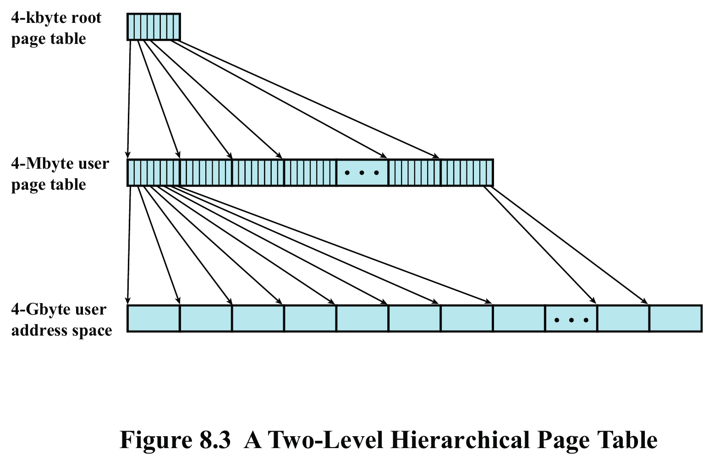

- Remember root page table always exists in the main memory.

#+ATTR_HTML: :alt Figure 8.4 Address Translation in a Two-Level Paging System
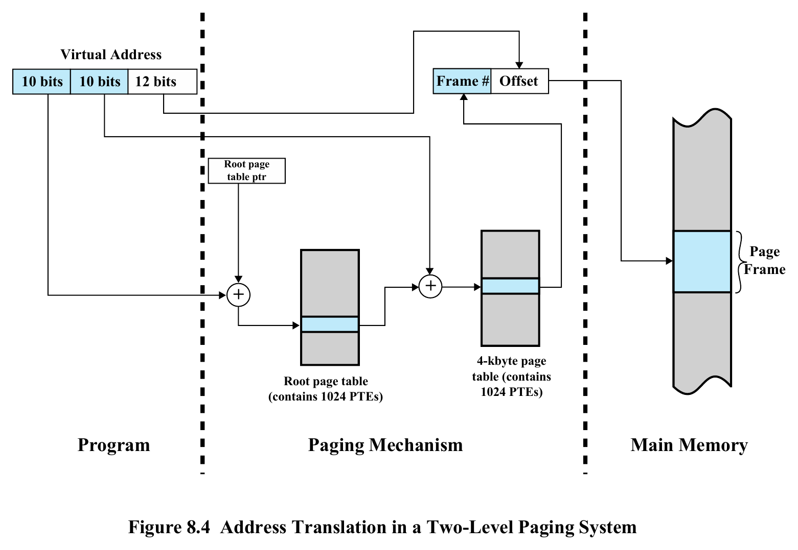

- Modern chips have the ability to keep 4-5 levels of page table hierarchy.

** Inverted Page Table

- A key drawback of the conventional page tables discussed so far is that their size is proportional to the virtual address space, and is paid per process, regardless of how much memory the process actually uses.
- An alternative approach is the Inverted Page Table.
- Instead of keeping one entry per virtual page per process, it keeps a single system-wide table with one entry per physical frame, recording which page of which process currently occupies that frame. Its size is therefore bounded by physical memory, not by the virtual address space.
- Since the table is organized by frame rather than by virtual page number, we can no longer index it directly.
  - A hash function on the (process ID, virtual page number) pair locates the matching entry.

#+ATTR_HTML: :alt Figure 8.5 Inverted Page Table Structure
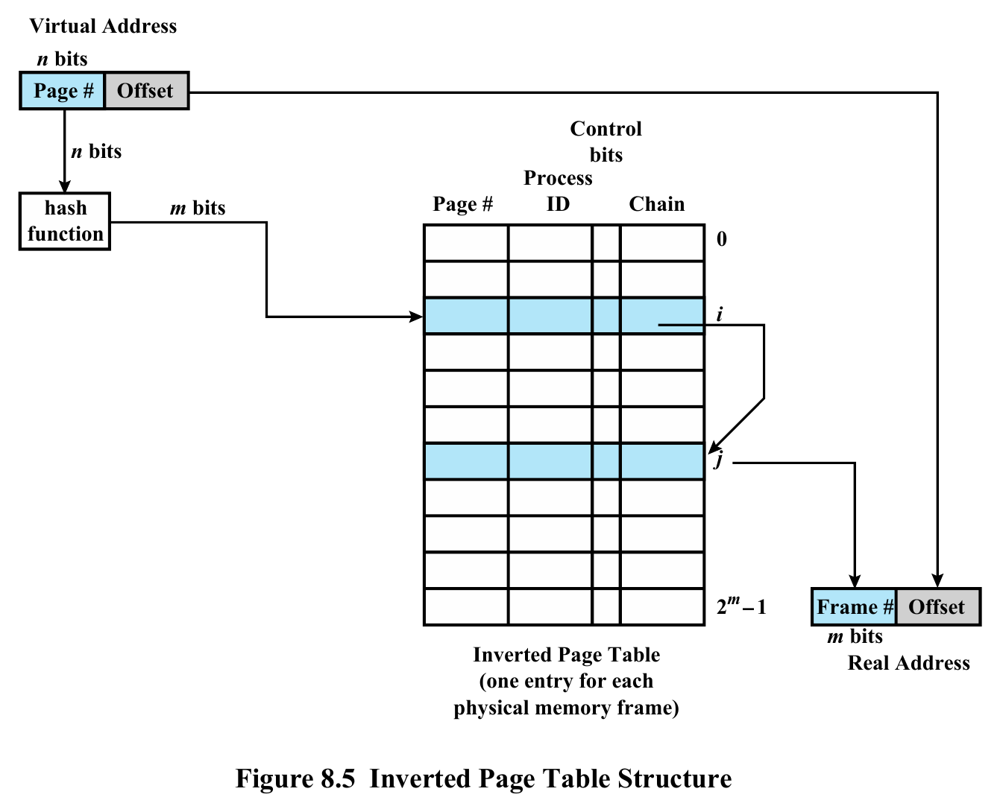

What are the implication?
- Fixed proportion of real memory is required for the tables regardless of the number of processes or virtual pages supported.
- One page table for all processes since the entries are keeping track of frames instead of pages of a process.
- Is this better?

Structure is called inverted because it indexes page table entries by frame number rather than by virtual page number.

{{{hl(blue,Animation slide: =inverted-page-table.html=. The animation itself is not in the PDF.)}}}

Each entry in the page table contains the following information:

| Field              | Meaning                                                 |
| Page number        |                                                         |
| Process identifier | The process that owns this page                         |
| Control bits       | Includes flags and protection and locking information   |
| Chain pointer      | The index value of the next entry in the chain          |

- Modern systems uses multi-level page tables instead of inverted page tables.
- Yet, they're the historically interesting alternative more than the common one today.

** Translation Lookaside Buffer (TLB)

Question:
- How many memory accesses are needed to access a particular memory address using this paging scheme in the best case?
  - You first need to access the page table to locate the frame address, then use it to form the physical address, which allows access to the intended memory location.
  - If there is page fault, then we need to bring the data from the secondary storage as well.
  - Basically, this paging scheme has the effect of doubling the memory access time.
- Due to this reason, most virtual memory access schemes uses a special high-speed cache for page tables called Translation Lookaside Buffer.

#+ATTR_HTML: :alt Figure 8.6 Use of a Translation Lookaside Buffer
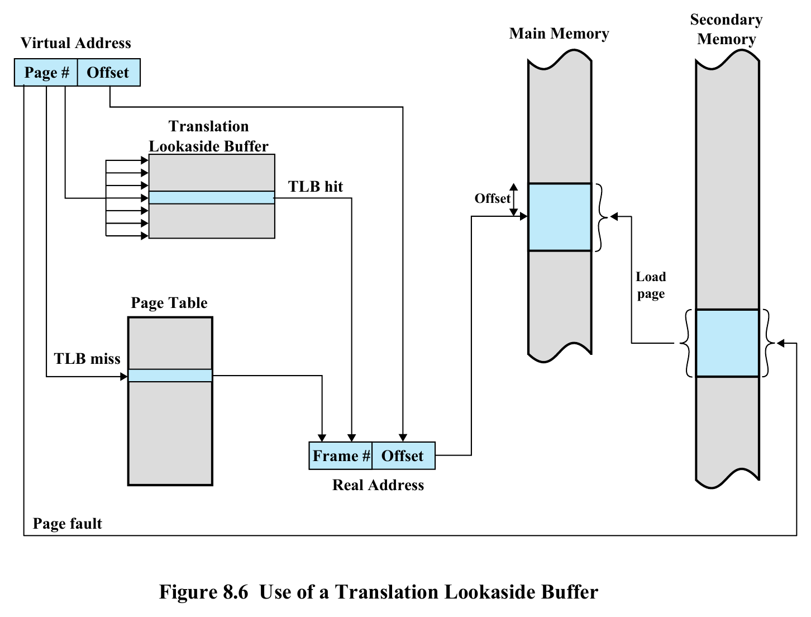

- Each entry in the TLB contains page number as well as the complete page table entry.
  - Some CPU architectures allow pages of multiple processes to be in the TLB at the same time, in fact most modern CPUs allow this. (ASID is needed)
  - In older systems, TLB only contains page entries of the currently running process, and after each context switch the TLB is flushed and loaded with new pages of the currently running process.
- Regardless, CPU still needs to go through the entries of the TLB to find an entry, but this is still costly, even the access time is low.
  - Thus, what hardware manufacturers did was to introduce circuitry to search all the TLB entries at once.
  - This is called /associative mapping/.
  - This introduce complexity to the circuitry and becomes more expensive to build, but we keep size of the TLB small reducing the overall cost.

#+ATTR_HTML: :alt Figure 8.7 Operation of Paging and Translation Lookaside Buffer (TLB) [FURH87]
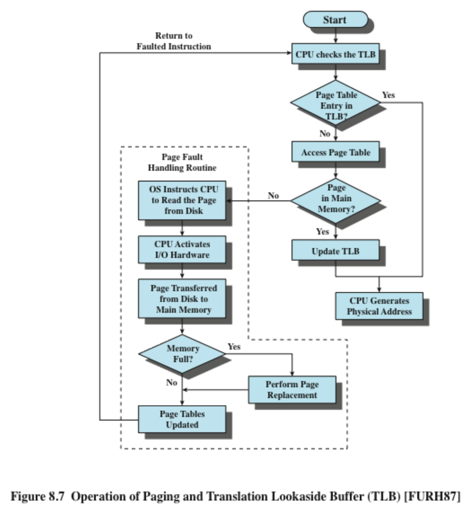

#+ATTR_HTML: :alt Figure 8.9 Translation Lookaside Buffer and Cache Operation
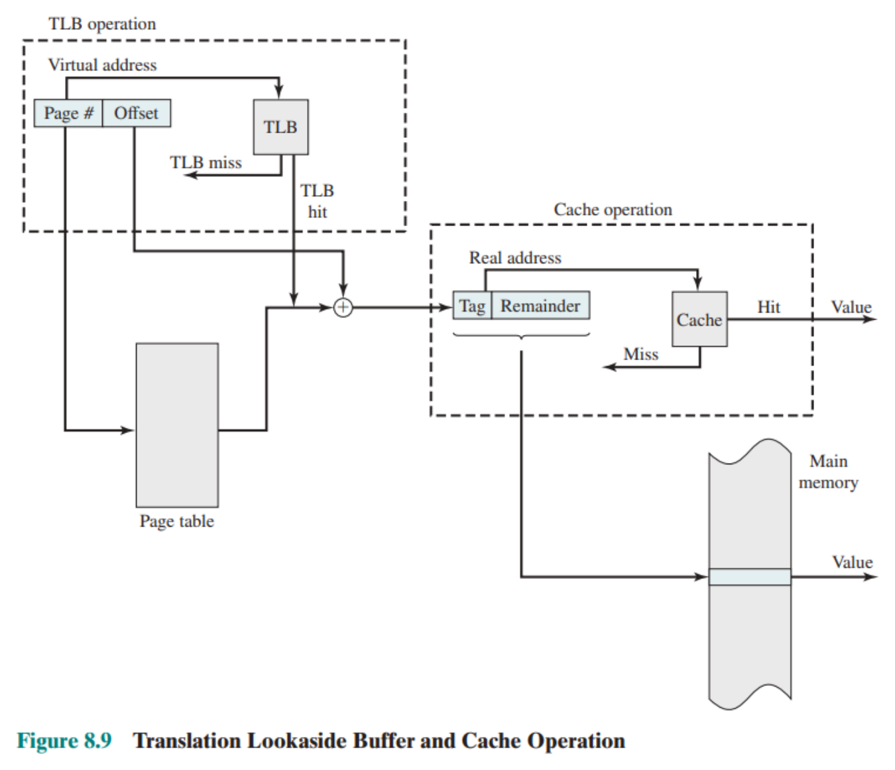

{{{hl(blue,Animation slides: =tlb-operation.html= and =tlb-cache-operation.html=. The animations themselves are not in the PDF.)}}}

** Page size

There are two major factors to consider.

1. Internal fragmentation
   - Smaller page sizes will lead to less internal fragmentation.
   - But will result in larger page table size.
     - Could occur double page faults.
       - First to bring in the needed portion of the page table, and second to bring in the process page.
2. Physical characteristics of the secondary storage.
   - Larger page sizes are better for secondary storages which are rotational as it would result in much efficient data transfer.
3. Size of the main memory and program size
   - Object oriented techniques may decrease the locality of references as it encourage to use a lot of smaller programs that is scattered across the memory.

*** Paging behavior

#+ATTR_HTML: :alt Figure 8.10 Typical Paging Behavior of a Program
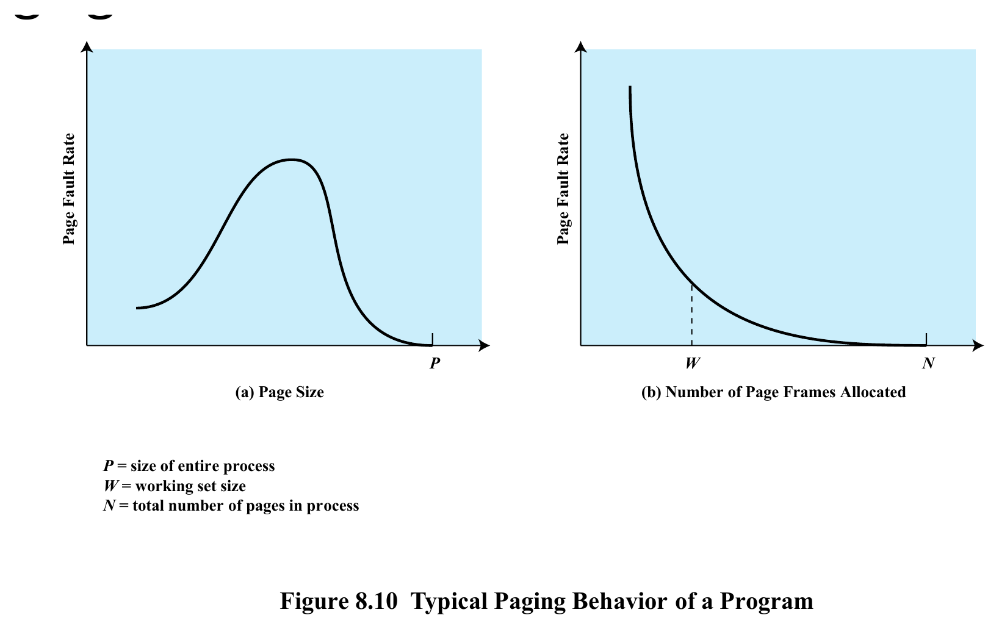

- $P$ = size of entire process
- $W$ = working set size
- $N$ = total number of pages in process

** Segmentation

Implications:
- Segmentation allows the programmer to view memory as consisting of multiple address spaces or segments
  - Instead of treating memory as a single, continuous block, segmentation splits it into smaller, logically distinct regions (segments). Each segment has its own starting address and size, and the programmer or operating system can treat these segments independently

Advantages:
- Simplifies handling of growing data structures
- Allows programs to be altered and recompiled independently
- Lends itself to sharing data among processes
- Lends itself to protection

*** Segment table

- Each segment table entry contains the starting address of the corresponding segment in main memory and the length of the segment
- A bit is needed to determine if the segment is already in main memory
- Another bit is needed to determine if the segment has been modified since it was loaded in main memory

#+ATTR_HTML: :alt Figure 8.11 Address Translation in a Segmentation System
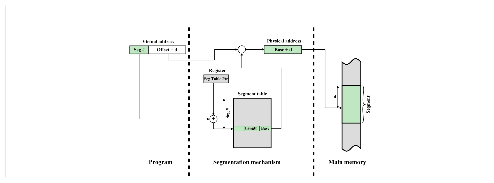

** Paging + Segmentation

In a combined paging/segmentation system a user's address space is broken up into a number of segments. Each segment is broken up into a number of fixed-sized pages which are equal in length to a main memory frame.
- Segmentation is visible to the programmer
- Paging is transparent to the programmer

#+ATTR_HTML: :alt Figure 8.12 Address Translation in a Segmentation/Paging System
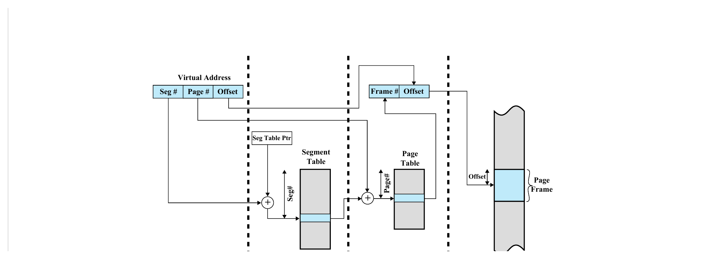

The combined address and table formats are panel (c) of Figure 8.1 above:
virtual address = /Segment Number/ + /Page Number/ + /Offset/; the segment table
entry holds /Control Bits/ + /Length/ + /Segment Base/; the page table entry
holds /P/ (present bit), /M/ (modified bit), other control bits and the
/Frame Number/.

** Operating system software

The design of the memory management portion of an operating system depends on three fundamental areas of choice:
1. Whether or not to use virtual memory techniques
2. The use of paging or segmentation or both
3. The algorithms employed for various aspects of memory management

The policy summary from the deck, left column:
- *Fetch Policy*
  - Demand paging
  - Prepaging
- *Placement Policy*
- *Replacement Policy*
  - Basic Algorithms
    - Optimal
    - Least recently used (LRU)
    - First-in-first-out (FIFO)
    - Clock
  - Page Buffering

Right column:
- *Resident Set Management*
  - Resident set size
    - Fixed
    - Variable
  - Replacement Scope
    - Global
    - Local
- *Cleaning Policy*
  - Demand
  - Precleaning
- *Load Control*
  - Degree of multiprogramming

*** Fetch Policy

Determines when a page should be brought into memory. Two main types: /Demand Paging/ and /Prepaging/.

- Demand Paging
  - Only brings pages into main memory when a reference is made to a location on the page
  - Many page faults when process is first started
  - Principle of locality suggests that as more and more pages are brought in, most future references will be to pages that have recently been brought in, and page faults should drop to a very low level
- Prepaging
  - Pages other than the one demanded by a page fault are brought in
  - Exploits the characteristics of most secondary memory devices
  - If pages of a process are stored contiguously in secondary memory it is more efficient to bring in a number of pages at one time
  - Ineffective if extra pages are not referenced
  - Should not be confused with "swapping"

*** Placement Policy

- Determines where in real memory a process piece is to reside
- Important design issue in a segmentation system
- Paging or combined paging with segmentation placing is irrelevant because hardware performs functions with equal efficiency.

*** Replacement Policy

- Deals with the selection of a page in main memory to be replaced when a new page must be brought in
  - Objective is that the page that is removed be the page least likely to be referenced in the near future
- The more elaborate the replacement policy the greater the hardware and software overhead to implement it

**** Frame Locking

- When a frame is locked the page currently stored in that frame may not be replaced
  - Kernel of the OS as well as key control structures are held in locked frames
  - I/O buffers and time-critical areas may be locked into main memory frames
  - Locking is achieved by associating a lock bit with each frame

**** Basic Algorithms

Algorithms used for the selection of a page to replace:
- Optimal
- Least recently used (LRU)
- First-in-first-out (FIFO)
- Clock

#+ATTR_HTML: :alt Figure 8.14 Behavior of Four Page-Replacement Algorithms
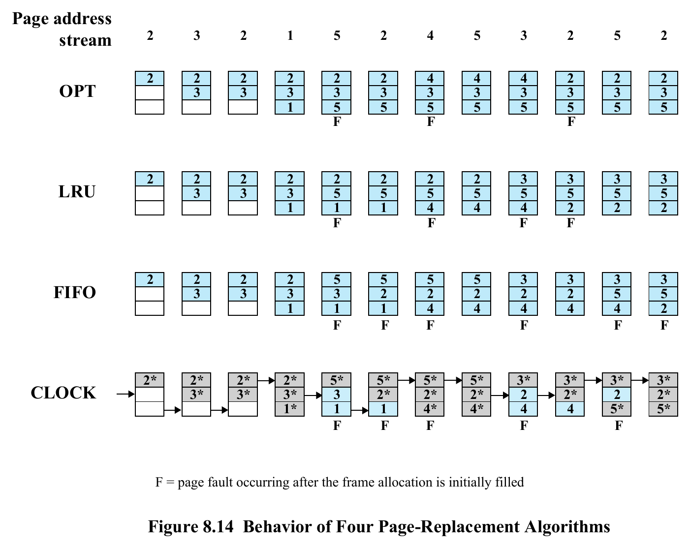

F = page fault occurring after the frame allocation is initially filled

The figure's example worked out, reference string =2 3 2 1 5 2 4 5 3 2 5 2= in
*3 frames*:

| Algorithm | Replaces                                       | Faults after fill | Total faults |
| Optimal   | the resident page referenced /furthest in the future/ | 3                 | 6            |
| LRU       | the page /unreferenced the longest/                 | 4                 | 7            |
| FIFO      | the page /resident the longest/, regardless of use   | 6                 | 9            |
| Clock     | FIFO, but skip (and clear) pages whose /use bit/ is 1 | 5                 | 8            |

- /Optimal/ needs the future, so it cannot be implemented; it is the lower bound
  the others are measured against.
- /Clock/ is the practical approximation of LRU: frames sit in a circular buffer
  with a pointer; a referenced page gets its use bit set to 1. The pointer advances
  over the buffer, clearing 1s to 0 as it goes, and replaces the first page it finds
  already at 0.
- The first references into empty frames are faults too, note whether a question
  wants /total/ faults or only the ones /after the frames first fill/ (Figure 8.14
  marks only the latter).

{{{hl(blue,Animation slide: =page_replacement (2).html=. The animation itself is not in the PDF.)}}}

*** Resident Set Management

The OS must decide how many pages to bring into main memory
- The smaller the amount of memory allocated to each process, the more processes can reside in memory
- Small number of pages loaded increases page faults
- Beyond a certain size, further allocations of pages will not affect the page fault rate

**** Resident Set Size

- Fixed Allocation
  - Gives a process a fixed number of frames in main memory within which to execute
    - When a page fault occurs, one of the pages of that process must be replaced
- Variable Allocation
  - Allows the number of page frames allocated to a process to be varied over the lifetime of the process
  - Appears to be more powerful.
  - Requires the operating system to assess the behavior of active processes.

**** Replacement Scope

The scope of a replacement strategy can be categorized as global or local
- Both types are activated by a page fault when there are no free page frames

| Scope  | Description                                                                 |
| Local  | Chooses only among the resident pages of the process that generated the page fault |
| Global | Considers all unlocked pages in main memory                                 |

** Why paging won against segmentation?

1. Simpler memory management
2. Better support for virtual memory
   - as segments have variable sizes, making swapping and memory protection trickier.
3. Improved memory protection.
   - While segments can have access controls, the variable sizes and logical boundaries make protection less granular and harder to enforce consistently, especially in complex programs.
4. Compatibility with modern hardware
   - Paging aligns better with the design of modern hardware, making it faster and more efficient to implement.
