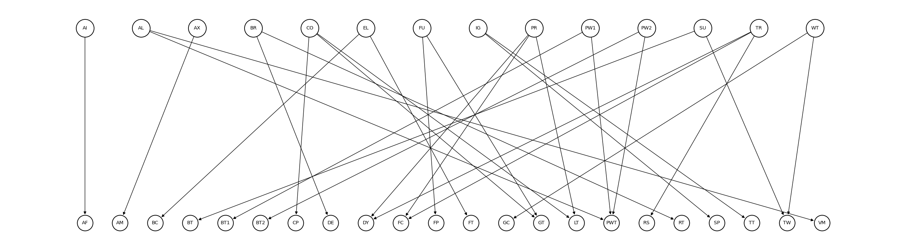

#+TITLE: Projects
#+AUTHOR: Ben Heinze
#+DATE: 2026-08-18
#+STARTUP: noindent

#+MACRO: hl @@html:$2@@@@latex:\hl{$1}{$2}@@

# This is used to shrink the pdf page margins
#+LATEX_HEADER: \usepackage[left=0.75in,right=0.75in,top=1in,bottom=1in]{geometry}

# This is used to shrink the spacing between bullet points
#+LATEX_HEADER: \usepackage{enumitem}
#+LATEX_HEADER: \setlist[itemize]{itemsep=2pt, topsep=4pt}

* Diagnostic Testing

** Introduction

   Imagine you bought a brand new Toyota Camry hybrid with 52
   miles on it, nice! This is the most valuable asset you own
   (obviously you dont own a house), and you need to keep it in
   the best condition possible to make sure
   it runs for as long as possible. This means observing and swapping out the
   spark plugs regularly, checking the oil twice as often as you did with your
   last beater car, remembering to rotate your tires, etc. There's
   a million different things you need to check on your car, some
   tests need to be checked more often while some components can
   go longer without being cared for. The goal is to maximize car
   operating time while minimizing the cost. To accomplish getting
   the best life out of your new car, you're going to need to know
   information like when you should expect a component to fail,
   how worn out a part is in the car, how long can this a
   particular part safely work before it needs to be replaced,
   what car parts should you check first when your car stops
   working, etc.

** Bayesian Networks

** Predicting Failures

* Vehicle Model Example

The vehicle model example is a simplified, bipartite version from Perreault's dissertation [cite:@perreaultPhD;@perreaultPBL] and discussed in the context of risk-based prognostics and health management (rPHM) in Sheppard's work [cite:@RCIS].
The model is based on High Mobility Multipurpose Wheeled Vehicle (HMMWV, or Humvee) real-world data [cite:@perreaultPhD]. The following model consists of 14 faults and 22 different tests.

The D-matrix below gives the relationship between each of the 14 faults (rows)
and 22 tests (columns) in the model. A $1$ at the intersection of a fault and a
test means the test can detect that fault; a $0$ means it can't. Tests can be
related to multiple faults — for example, test $TW$ (tread wear) is related to
both $SU$ (suspension system) and $WT$ (wheels/tires).

| Fault | AF | AM | BC | BT | BT1 | BT2 | CP | DE | DY | FC | FP | FT | GC | GT | LT | PWT | RS | RT | SP | TT | TW | VM |
|-------+----+----+----+----+-----+-----+----+----+----+----+----+----+----+----+----+-----+----+----+----+----+----+----|
| AI    |  1 |  0 |  0 |  0 |   0 |   0 |  0 |  0 |  0 |  0 |  0 |  0 |  0 |  0 |  0 |   0 |  0 |  0 |  0 |  0 |  0 |  0 |
| AL    |  0 |  0 |  0 |  0 |   0 |   0 |  0 |  0 |  0 |  0 |  0 |  0 |  0 |  0 |  0 |   1 |  0 |  0 |  0 |  0 |  0 |  1 |
| AX    |  0 |  1 |  0 |  0 |   0 |   0 |  0 |  0 |  0 |  0 |  0 |  0 |  0 |  0 |  0 |   0 |  0 |  0 |  0 |  0 |  0 |  0 |
| BR    |  0 |  0 |  0 |  0 |   0 |   0 |  0 |  1 |  0 |  0 |  0 |  0 |  0 |  0 |  0 |   0 |  0 |  1 |  0 |  0 |  0 |  0 |
| CO    |  0 |  0 |  0 |  0 |   0 |   0 |  1 |  0 |  0 |  0 |  0 |  0 |  0 |  1 |  1 |   0 |  0 |  0 |  0 |  0 |  0 |  0 |
| EL    |  0 |  0 |  1 |  0 |   0 |   0 |  0 |  0 |  0 |  0 |  0 |  1 |  0 |  0 |  0 |   0 |  0 |  0 |  0 |  0 |  0 |  0 |
| FU    |  0 |  0 |  0 |  0 |   0 |   0 |  0 |  0 |  0 |  0 |  1 |  0 |  0 |  1 |  0 |   0 |  0 |  0 |  0 |  0 |  0 |  0 |
| IG    |  0 |  0 |  0 |  0 |   0 |   0 |  0 |  0 |  0 |  0 |  0 |  0 |  0 |  0 |  0 |   0 |  0 |  0 |  1 |  1 |  0 |  0 |
| PR    |  0 |  0 |  0 |  0 |   0 |   0 |  0 |  0 |  1 |  1 |  0 |  0 |  0 |  0 |  1 |   0 |  0 |  0 |  0 |  0 |  0 |  0 |
| PW1   |  0 |  0 |  0 |  0 |   1 |   0 |  0 |  0 |  0 |  0 |  0 |  0 |  0 |  0 |  0 |   1 |  0 |  0 |  0 |  0 |  0 |  0 |
| PW2   |  0 |  0 |  0 |  0 |   0 |   1 |  0 |  0 |  0 |  0 |  0 |  0 |  0 |  0 |  0 |   1 |  0 |  0 |  0 |  0 |  0 |  0 |
| SU    |  0 |  0 |  0 |  1 |   0 |   0 |  0 |  0 |  0 |  0 |  0 |  0 |  0 |  0 |  0 |   0 |  0 |  0 |  0 |  0 |  1 |  0 |
| TR    |  0 |  0 |  0 |  0 |   0 |   0 |  0 |  0 |  1 |  1 |  0 |  0 |  0 |  0 |  0 |   0 |  1 |  0 |  0 |  0 |  0 |  0 |
| WT    |  0 |  0 |  0 |  0 |   0 |   0 |  0 |  0 |  0 |  0 |  0 |  0 |  1 |  0 |  0 |   0 |  0 |  0 |  0 |  0 |  1 |  0 |

The rows correspond to the 14 different faults while the columns correspond to
the 22 tests in the model. The diagram below shows the resulting bipartite
Bayesian network structure: an edge runs from each fault down to every test
that can detect it. Press =C-c C-c= on the block to (re)generate the image.

#+NAME: vehicle-network
#+begin_src python :results silent
import matplotlib
matplotlib.use("Agg")
import matplotlib.pyplot as plt
import networkx as nx

faults = ["AI", "AL", "AX", "BR", "CO", "EL", "FU", "IG", "PR", "PW1", "PW2", "SU", "TR", "WT"]
tests = ["AF", "AM", "BC", "BT", "BT1", "BT2", "CP", "DE", "DY", "FC", "FP", "FT",
         "GC", "GT", "LT", "PWT", "RS", "RT", "SP", "TT", "TW", "VM"]
edges = [
    ("AI", "AF"),
    ("AL", "PWT"), ("AL", "VM"),
    ("AX", "AM"),
    ("BR", "DE"), ("BR", "RT"),
    ("CO", "CP"), ("CO", "GT"), ("CO", "LT"),
    ("EL", "BC"), ("EL", "FT"),
    ("FU", "FP"), ("FU", "GT"),
    ("IG", "SP"), ("IG", "TT"),
    ("PR", "DY"), ("PR", "FC"), ("PR", "LT"),
    ("PW1", "BT1"), ("PW1", "PWT"),
    ("PW2", "BT2"), ("PW2", "PWT"),
    ("SU", "BT"), ("SU", "TW"),
    ("TR", "DY"), ("TR", "FC"), ("TR", "RS"),
    ("WT", "GC"), ("WT", "TW"),
]

G = nx.DiGraph()
G.add_nodes_from(faults, layer=0)
G.add_nodes_from(tests, layer=1)
G.add_edges_from(edges)

pos = {}
for i, f in enumerate(faults):
    pos[f] = (i * 1.6, 1)
for i, t in enumerate(tests):
    pos[t] = (i * 1.0, 0)

fig, ax = plt.subplots(figsize=(18, 5))
nx.draw_networkx_nodes(G, pos, nodelist=faults, node_size=650, node_color="white",
                        edgecolors="black", ax=ax)
nx.draw_networkx_nodes(G, pos, nodelist=tests, node_size=500, node_color="white",
                        edgecolors="black", ax=ax)
nx.draw_networkx_labels(G, pos, ax=ax, font_size=7)
nx.draw_networkx_edges(G, pos, node_size=600, arrowstyle="-|>", arrowsize=8,
                        width=0.7, ax=ax)

ax.set_axis_off()
fig.tight_layout()
fig.savefig("projects_img/vehicle-network.png", dpi=150)
#+end_src

#+ATTR_HTML: :width 900

Since this is a hypothetical model, the conditional probabilities for each node
will be synthesized for demonstration purposes. Each test and fault node has a
probability table attached to indicate the chances of a \textsc{Pass}/\textsc{Fail}, or
\textsc{Good}/\textsc{Bad} value respectively, which mirrors the three-node
Bayesian network example above. The probability tables for
the faults are marginal while the probabilities for the tests are conditioned
off of the parent fault nodes. Note that, given the relatively small number of
faults the each test detects, we are able to specify traditional AND-based
probability distributions. However, it is more typical to apply a Noisy-OR formulation
for these models to improve the computational complexity and number of parameters needed
for the Bayesian network.

Now that the Bayesian network model has been constructed, we need to calculate
the total information gain for each test. Let us demonstrate the calculation of
information gain for the tests related to the ignition system ($IG$). As shown
in the network diagram above, the ignition system has two tests associated
with it: The spark plug test ($SP$), which tests the spark plugs for ignition,
and the timing test ($TT$), which tests the distributor and timing belt.

First, let us calculate the entropy for the spark plug test. Let the fault for
the ignition sub-component be denoted as $F_{IG}$, and the spark plug test
be denoted as $T_{SP}$. The goal is to determine how much uncertainty test
$T_{SP}$ reduces about the status of fault $F_{IG}$. This is computed as

\[
  I(F_{IG}; T_{SP}) = H(F_{IG}) - H(F_{IG} \mid T_{SP}).
\]

Then the entropy and conditional entropy can be calculated with the probability
tables within the Bayesian network. For this example, the table below
shows the marginal probability table associated with the
ignition system fault. Similarly, the table after it shows the conditional
probability table for a spark plug test being able to detect the ignition fault.

| $F_{IG}$ | Probability |
|----------+-------------|
| Pass     |         0.7 |
| Fail     |         0.3 |

Probability table of the ignition system fault $P(F_{IG})$.

|                           | $T_{SP} = \textsc{Pass}$ | $T_{SP} = \textsc{Fail}$ |
|---------------------------+---------------------------+---------------------------|
| $F_{IG} = \textsc{Good}$  |                       0.9 |                       0.1 |
| $F_{IG} = \textsc{Bad}$   |                       0.4 |                       0.6 |

Conditional probability table for $P(T_{SP} \mid F_{IG})$.

First, we need to calculate the entropy  $H(F_{IG})$.
\begin{equation}
\label{eq:ignitionEntropy}
\begin{aligned}
H(F_{IG})
&= - \sum_{x \in F_{IG}} P(x)\,\log P(x) \\[0.5em]
&= - P(F_{IG}=\textsc{Good}) \log P(F_{IG}=\textsc{Good})
   - P(F_{IG}=\textsc{Bad}) \log P(F_{IG}=\textsc{Bad}) \\[0.75em]
&= -0.7 \log 0.7 - 0.3 \log 0.3 \\[0.5em]
&= 0.6109
\end{aligned}
\end{equation}
Next, we need to calculate the conditional entropy $H(F_{IG} \mid T_{SP})$.
\begin{align*}
    H(F_{IG} \mid T_{SP}) &= - \sum_{t \in T_{SP}} P(t) \sum_{f \in F_{IG}} P(f \mid t) \log P(f \mid t) \\
&= - P(T_{SP}=\textsc{Pass})
\Big[
P(f=\textsc{Good}\mid t=\textsc{Pass}) \log P(f=\textsc{Good}\mid t=\textsc{Pass}) \\
&\qquad\qquad\qquad\quad
+ P(f=\textsc{Bad}\mid t=\textsc{Pass}) \log P(f=\textsc{Bad}\mid t=\textsc{Pass})
\Big] \\
&\quad - P(T_{SP}=\textsc{Fail})
\Big[
P(f=\textsc{Good}\mid t=\textsc{Fail}) \log P(f=\textsc{Good}\mid t=\textsc{Fail}) \\
&\qquad\qquad\qquad\quad
+ P(f=\textsc{Bad}\mid t=\textsc{Fail}) \log P(f=\textsc{Bad}\mid t=\textsc{Fail})
\Big] \\[1em]
&= -0.75 \Big[ 0.84 \ln(0.84) + 0.16 \ln(0.16) \Big]
     -0.25 \Big[ 0.28 \ln(0.28) + 0.72 \ln(0.72) \Big] \\[0.75em]
&= -0.75(-0.1465 - 0.2932) - 0.25(-0.3564 - 0.2365) \\[0.5em]
&= 0.3298 + 0.1482 \\[0.5em]
&= 0.4780
\end{align*}
Finally, we take the difference of the entropy and conditional entropy to
calculate the information gain between $F_{IG}$ and $T_{SP}$.
\[
I(F_{IG};T_{SP}) = H(F_{IG})-H( F_{IG} \mid T_{SP} ) = 0.6109 - 0.4780 = 0.1329
\]
Thus, the information gain for $T_{SP}$ is $0.1329$.

Next, we will calculate the information gain for the second test for the
ignition system: timing test.

\[
I(F_{IG}; T_{TT}) = H(F_{IG}) - H(F_{IG} \mid T_{TT})
\]

The entropy for the ignition \(H(F_{IG})\) is already calculated in
Equation \(\eqref{eq:ignitionEntropy}\), so the conditional entropy will be explained next.
The table below shows the CPT for the timing test. From here, we
calculate the information gain in the same way.

|                           | $T_{TT} = \textsc{Pass}$ | $T_{TT} = \textsc{Fail}$ |
|---------------------------+---------------------------+---------------------------|
| $F_{IG} = \textsc{Good}$  |                       0.8 |                       0.2 |
| $F_{IG} = \textsc{Bad}$   |                       0.3 |                       0.7 |

Conditional probability table for $P(T_{TT} \mid F_{IG})$.

\begin{align*}
    H(F_{IG} \mid T_{TT}) &= - \sum_{t \in T_{TT}} P(t) \sum_{f \in F_{IG}} P(f \mid t) \log P(f \mid t) \\
&= - P(T_{TT}=\textsc{Pass})
\Big[
P(f=\textsc{Good}\mid t=\textsc{Pass}) \log P(f=\textsc{Good}\mid t=\textsc{Pass}) \\
&\qquad\qquad\qquad\quad
+ P(f=\textsc{Bad}\mid t=\textsc{Pass}) \log P(f=\textsc{Bad}\mid t=\textsc{Pass})
\Big] \\
&\quad - P(T_{TT}=\textsc{Fail})
\Big[
P(f=\textsc{Good}\mid t=\textsc{Fail}) \log P(f=\textsc{Good}\mid t=\textsc{Fail}) \\
&\qquad\qquad\qquad\quad
+ P(f=\textsc{Bad}\mid t=\textsc{Fail}) \log P(f=\textsc{Bad}\mid t=\textsc{Fail})
\Big] \\[1em]
&= -0.65 \Big[ 0.862 \ln(0.862) + 0.138 \ln(0.138) \Big]
     -0.35 \Big[ 0.40 \ln(0.40) + 0.60 \ln(0.60) \Big] \\[0.75em]
&= -0.65(-0.1280 - 0.2733) - 0.35(-0.3665 - 0.3065) \\[0.5em]
&= 0.2608 + 0.2355 \\[0.5em]
&= 0.4963\\
I(F_{IG}; T_{TT}) &= H(F_{IG}) - H(F_{IG} \mid T_{TT}) = 0.6109 - 0.4963 = 0.1146
\end{align*}

If a test has relationships between multiple faults, we can calculate the total
information gain from a test across all faults by summing the mutual information
gain calculated between the test and every fault associated with that test. In
our example, the tests for the ignition system only test $IG$ (i.e., only have
one parent each), so our final total information gain for each of the relevant
tests is  $T_{SP} = 0.1329$ and $T_{TT} = 0.1146$. Since the spark plug test has
a higher information gain, that test should be ranked higher than the timing
test. A diagnostic sequence can be generated by repeating this process across
every test online, while testing is taking place.

* References

#+print_bibliography:
